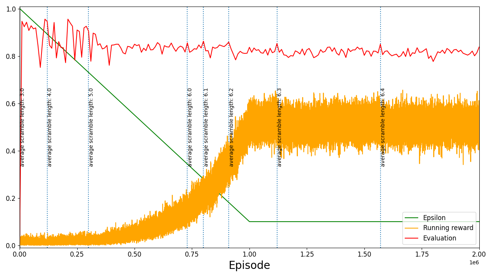

# 2x2 Cube Solver

A Dueling Double DQN implementation of a 2x2 Rubik's cube solver.

## Description

Inside the `2x2-cube-solver` directory, `cube.py` and `cube_env.py` define the
2x2 Rubik's cube and its Gym environment.

`dueling_dqn.py` is a simple 4-layer Dueling DQN model implemented in PyTorch,
with separate outputs for the state value and the action advantages.

Training the model is done using `train.py`, and the trained model can be used
to solve cubes through `solve.py`.

## Usage

### Training

To train a model, set the configuration variables in `config.py` and
run `train.py`.
The trained model as well as the training configuration and a plot of the
training run are saved in the `training-runs` directory.

Resuming a previous training run can be done by setting the `RESUME_RUN_ID`
configuration variable.

### Solving

Two ways of solving cubes using a trained model are available in `solve.py`.

The first method uses the `evaluate_model` function and solves a large number
of randomly scrambled cubes. Solve results and a plot of the solution length
distribution are displayed.

The second method uses the `solve_scramble` function and solves a single cube
scrambled according to a given scramble. This can be used to examine a model's
performance for a specific scramble of interest.

For solving, the configuration variables must be set inside the respective
functions before calling them in `solve.py`.

## Development and training

Initially, the scramble length was fixed for the entire training run. Because a
reward was only given when the cube was solved, and the chance of reaching the
solved state through almost random moves from a sufficiently well-scrambled
initial state was extremely low, the model learned almost nothing.

To fix this, the training process was changed so that the scramble length was
initially set to a small number and was increased by 1 every time the model
reached a certain solution rate threshold during evaluation. This solved the
previous problem of the model not learning, but another problem emerged, which
was [catastrophic forgetting](https://en.wikipedia.org/wiki/Catastrophic_interference)
. Whenever the scramble length was increased, there was a good chance that the
model would rapidly forget most of its previously learned knowledge.

An attempt to mitigate this problem was to ensure that some scrambles of the
previous length were included along with the current length scrambles, but this
was unsuccessful. What finally worked was to introduce a concept of average
scramble length and to increase this value in increments of 0.1. The average
scramble length determined the proportion of scramble lengths given to the
model. For example, if the average scramble length was 5.2, 80% of the training
scrambles would be of length 5, and the remaining 20% would be of length 6.
This allowed a much more gradual change in the model's training data and
resulted in stable training.

The training runs for the final model can be found in the `training-runs`
directory. It was trained over 7 training runs and 12 million steps, starting
at an average scramble length of 3.0. The plot for the first training run is
shown below. As can be seen in the plot, the rate of increase of the scramble
length decreased as the training progressed. Training was ultimately stopped at
an average scramble length of 7.1 as progress at that point was getting
stagnant.

|            |
|:--------------------------------------------------:|
| Plot of the first training run for the final model |
